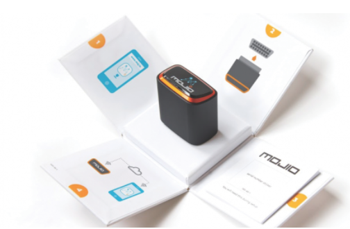

# Mojio 

## Overview and Origin
----

Mojio, a Canadian startup, was founded in 2012 in Vancouver. The co-founders are David Shore, Jay Giraud, Narayan Sainaney, and Richard Woodruff. They believe all cars and driving experience are different. We should give a voice to every single car. 

With the significantly increasing demand in data-driven technology and dropping cost in both Internet and automotive parts, Mojio envisions and invests a world where every single vehicle can be connected. Throught this connection, Mojio's platform, apps and services aim to 'deliver a smarter, safer and more convenient car ownership experience for the global driving community'. 

As a startup, Mojio started its business with a pre-seed of $50,000 in 2013. By now, it has successfully received five rounds of investments from Amazon Alexa fund, Telus Ventures, T-Mobile and so on. The total funding amount by May 2021 is $80.8 millions.

## Business Activities:
-----------

Mojio provides a "dongle' to vehicles that have the On Board Diagnostic II (ODB) port. Pretty much all cars after 1995. So, the voice of every single vehicle could be heard through the data collected by this little device. Mojio stores data on their platform and reports data in near real time. By using SaaS, intelligent data analysis, and machine learning, Mojio creates an open platform for vehicle performance, diagnostics, and analytics.

Mojio works with major mobile network operators (MNO), such as Telus, to provide service for all subsribers. This allows that the in real time data could be not only collected and read within Bluetooth range but also connected to Mojio's servers through built-in connections including 4G LTE. Thus, the car data could become a value-added service for insurance companies, automotive dealers and their customers.

The aftermarket is big since many vehicles in the current market still use closed systems. However, the competition in FinTech is dramatically increased in recent years. So, Mojio partners with other large companies in order to seize the opportunities. For example, Mojio works with Bosch to co-develop and deliver an advanced connected car services for vehicle communication, diagnostics and crash detection and notification since 2018. Meanwhile, Mojio also parterns with Force, which provides small businesses a simple and affordable GPS tracking service. With the service powered by Mojio, small business could track vehicles to increase accountability, monitor fleet health to increase safety, and sharpen the edges to reduce cost.

## Landscape:
-----

Mojio is a InsurTech company who helps companies create actionable insights and capture new revenue streams. With the dramatic change and growth in technologies, especially cloud computing and digital transfermation, the demanding for InsurTech stays high in recent 5 years. The impact of pandemic also accelerates the necessary of InsurTech in the insurance industry. Among all these demands, use of IoT to gauge policy pricing, particularly for car insurance, is increasing significantly. One for all policy became malapropos. Instead, customers urge a new policy that will tailor their needs, such as the actual usage and individual performance. 

The competition in InsurTech domain heats up over recent years. Many startup companies have popped up around the world. Among them, Harman internationl and Automatic labs are the major competitors for Mojio. 

## Results
------
Mojio is a leading cloud platform and SaaS provider for connected cars. It has proven that the power of IoT can deliver add-value to the whole automotive value chain and provide a win-win solution for both companies and their customers. Mojio creates an open platform, which attracts developers to make their own contributions in the event of innovation. Closesly working with other partners who are also leading companies their fields also makes Mojio distinguished from other competitors. 

For InsurTech companies, core metrics are hard to identify. One way is by calculating the total fundings attracted and projects lauched by the company. As a startup, Mojio has successfully secured over $80 millions from investors, which is significantly larger than its competitors. Through co-development and partnership with OEM, MNO, and other major parts in the automotive value chain, Mojio delivers three major products: Connected Mobility Platform, Motion for Consumers, and Force for Fleets. It also provides solutions for MNO and automakers. Mojio realizes the importance of go-to-market. So, understanding customer's unique journey and providing both service and educating beyond the products become more and more important. The other way to measure the success for an InsurTech company is to determine the actual revenue created and the actual cost reduced by products or services. We will need more inside data to valuate it.

## Recommendations
--------
### 1. Think beyond Current Legislation and Regulation
One of ongoing challenges facing by InsurTech companies is the legislative and regulatory issues associated with collecting, sharing and analysing the sensitive data from customers. Rules are added and modified by governments on an ongoing basis, in order to catch up the rapid changes in technology. InsurTech companies should have the ability to predict potential issues caused by innovation. The practice conducted by InsurTech companies should be also well managed and monitored by their own compliance department. Especially, products and services are delivered to different countries where the laws may significantly differ from others.

### 2. Built-in Service,Instead of Optional Service
Although Mojio works closely with major OEMs and MNOs and provides open platform for developers, the target market is still aftermarket. When Mojio established, the car operation systems were closed system. Mojio's product became a nice-to-have service for vehicle owners. However, technology has subverted our cognition in the last five years. The car operating system is becoming more open and intelligent. This trend could threaten Mojio's profitability. Finding a way to switch the service from optional to built-in would be a good method. One of the approaches would be working with large car manufacturers to build in Mojio's product and service for new cars. 

## Resources:
--------
1. Crunchbase: https://www.crunchbase.com/organization/mojio
2. Mojio Website: https://www.moj.io/
3. Mojio: Big Data on vehicles plus a open platform equals easy IoT analytic apps. 
https://www.networkworld.com/article/2844943/mojio-big-data-on-vehicles-plus-a-open-platform-equals-easy-iot-analytic-apps.html
4. Bringing today’s tech—GPS, efficiency tracking, and more—to 15-year-old clunkers: https://arstechnica.com/cars/2015/06/automatic-and-mojio-bring-modern-luxury-gps-efficiency-to-15-year-old-clunkers/
5. Bosch Website: https://us.bosch-press.com/pressportal/us/en/press-release-4288.html
6. Force by Mojio: https://forcebymojio.com/
7. Top 10 insurtech companies in Canada: https://www.insurancebusinessmag.com/ca/news/digital-age/top-10-insurtech-companies-in-canada-214331.aspx
8. Tech trends that will transform the insurance industry in 2021: https://www.insurancebusinessmag.com/ca/news/breaking-news/tech-trends-that-will-transform-the-insurance-industry-in-2021-251194.aspx
9. Competition heats up among insurtechs: https://www.insurancebusinessmag.com/us/news/technology/competition-heats-up-among-insurtechs-117654.aspx
10. Mojio Brings Connected Car Leadership to Internet of Things Consortium (IoTC):  https://www.globenewswire.com/news-release/2018/12/20/1670499/0/en/Mojio-Brings-Connected-Car-Leadership-to-Internet-of-Things-Consortium-IoTC.html
11. How to determine the metrics of InsurTech success: https://www.propertycasualty360.com/2019/09/09/how-to-determine-the-metrics-of-insurtech-success/?slreturn=20210415174051
12. InsurTech - Opportunities and Legal Challenges for the Insurance Industry: https://www.bakermckenzie.com/en/insight/publications/2020/09/insurtech-opportunities-and-legal-challenges 
13. Vancouver tech firms pave way for safer connected cars: https://biv.com/article/2015/09/vancouver-tech-firms-pave-way-safer-connected-cars

